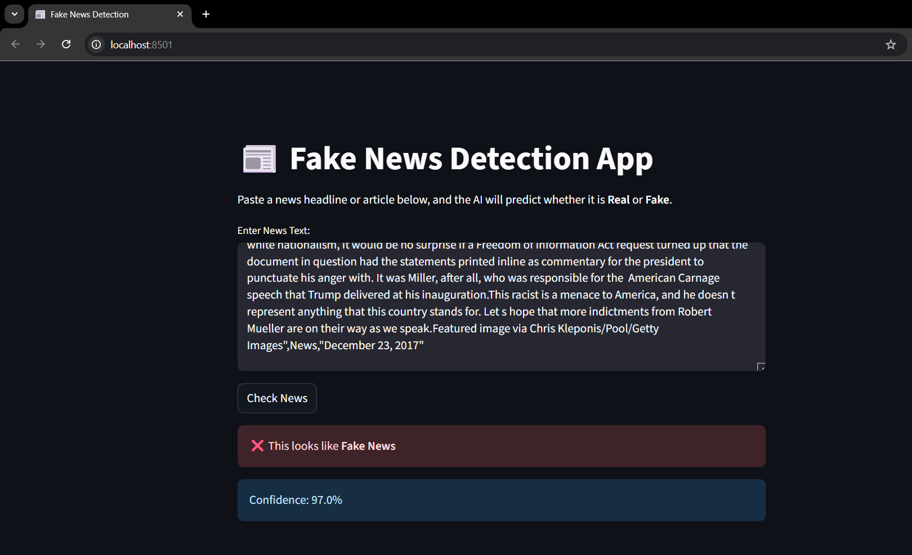
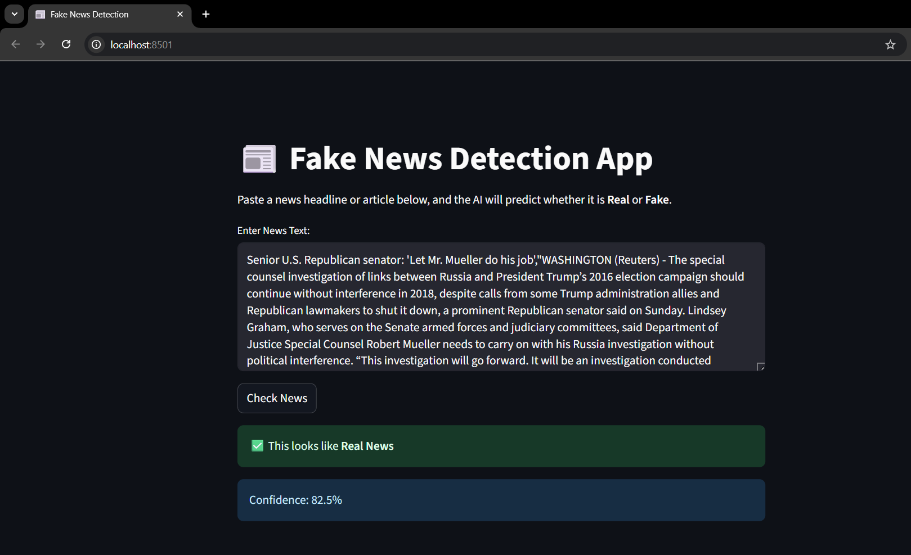

# 📰 Fake News Detection Using Machine Learning

A **Machine Learning–powered web application** that predicts whether a news article is **Real** or **Fake**.
The app provides real-time predictions through an interactive **Streamlit web interface**.

---

## 📌 Problem Statement

The rapid spread of **fake news** on social media and online platforms has become a critical issue, influencing public opinion and even elections.
Detecting fake news early helps promote **reliable information** and reduce **misinformation**.

This project aims to:

> 🧪 Predict whether a news text is **Real** or **Fake** using **Natural Language Processing (NLP)** and **Machine Learning**.

---

## 🎯 Objectives

* Preprocess and analyze a large fake news dataset.
* Train and compare multiple ML models for accuracy.
* Deploy a **Streamlit app** for real-time predictions.

---

## 🗃️ Dataset Details

* **Name**: Fake and Real News Dataset
* **Source**: Kaggle – [Fake and Real News Dataset](https://www.kaggle.com/clmentbisaillon/fake-and-real-news-dataset)
* **Format**: CSV (`Fake.csv` and `True.csv`)
* **Rows**: \~44,000 combined entries
* **Labels**: `1 = Real`, `0 = Fake`

### 🔑 Features Used

| Feature | Description                           |
| ------- | ------------------------------------- |
| Title   | Title of the news article             |
| Text    | Full article content                  |
| Subject | Topic of the article (e.g., politics) |
| Date    | Published date                        |

---

## 🧠 Machine Learning Approach

### ✅ Data Preprocessing

* Removed stopwords, punctuation, and special characters.
* Applied **TF-IDF Vectorization** for text representation.
* Train-test split → **80% training / 20% testing**.

### 🤖 Models Tested

| Model                   | Accuracy | Precision | Recall | F1 Score |
| ----------------------- | -------- | --------- | ------ | -------- |
| **Random Forest**       | 0.9986   | 0.9981    | 0.9990 | 0.9986   |
| **XGBoost**             | 0.9979   | 0.9974    | 0.9983 | 0.9979   |
| **SVM**                 | 0.9959   | 0.9948    | 0.9967 | 0.9958   |
| **Gradient Boosting**   | 0.9959   | 0.9946    | 0.9969 | 0.9958   |
| **Logistic Regression** | 0.9896   | 0.9851    | 0.9932 | 0.9891   |
| **Naive Bayes**         | 0.9388   | 0.9313    | 0.9411 | 0.9362   |
| **KNN**                 | 0.7057   | 0.9486    | 0.4052 | 0.5678   |

✔ **Best Model**: `Random Forest` → Highest accuracy and balanced metrics.
📂 Saved model → **`model_Random_Forest.pkl`** (large file, stored in Release).

---

## 💡 Project Workflow

```
1. Load and preprocess dataset → clean text, remove stopwords
2. Train multiple ML models → Random Forest, XGBoost, SVM, etc.
3. Evaluate models → Accuracy, Precision, Recall, F1 Score
4. Save best model & TF-IDF vectorizer
5. Build Streamlit app → text input box
6. Make real-time predictions
```

---

## 💻 Web App Features

* 🖥️ Interactive **Streamlit interface**
* ✍️ Input a news article or headline
* ⚡ Instant Prediction →

  * ✅ Real News
  * ❌ Fake News

---

## 📸 App Screenshots

### 🔴 Fake News Prediction



### 🟢 Real News Prediction



---

## 🚀 How to Run Locally

### 1️⃣ Clone the Repository

```bash
git clone https://github.com/your-username/fake-news-detection.git
cd fake-news-detection
```

### 2️⃣ Download Best Model

The trained **Random Forest model** is too large to keep in the repo.
👉 Download it from **[Release v1.0.0 – Fake News Detection: First Release](https://github.com/frijo12/fake-news-detection-ml/releases/tag/v1.0.0)**.

Save it as:

```
model_Random_Forest.pkl
```

in the project root folder.

### 3️⃣ Install Dependencies

```bash
pip install -r requirements.txt
```

### 4️⃣ Start the Streamlit App

```bash
streamlit run app.py
```

### 5️⃣ Open in Browser

👉 [http://localhost:8501](http://localhost:8501)

---

## 📁 Project Structure

```
fake-news-detection/
├── app.py                        # Streamlit app
├── dataset/
│   ├── Fake.csv                  # ZIP file
│   └── True.csv                  # ZIP file
├── model_Random_Forest.pkl       # Best trained model (downloaded from Release v1.0.0)
├── tfidf_vectorizer.pkl          # TF-IDF vectorizer (stored in repo)
├── screenshots/
│   ├── fake_prediction.png
│   └── real_prediction.png
├── requirements.txt
└── README.md
```

📌 **Note:**

* `model_Random_Forest.pkl` → Download from Release v1.0.0.
* `tfidf_vectorizer.pkl` → Available directly in the repo.

---

## 📦 Requirements

```txt
streamlit
scikit-learn
pandas
numpy
xgboost
```

Install with:

```bash
pip install -r requirements.txt
```

---

## 📌 Future Improvements

* 📊 Add **visual analytics** (word clouds, dataset stats).
* 🌍 Deploy on **Streamlit Cloud / Hugging Face Spaces** for public access.
* 🌐 Train with **multilingual datasets** to cover global news.

---

## 🧾 License

This project is open-source and available under the **MIT License**.

---

## ✨ Author

👨‍💻 **Frijo Antony CF**
🎓 Final Year B.Tech CSE Student
💡 Passionate about **AI, ML & Web Apps**
📫 Contact: [LinkedIn](https://www.linkedin.com/in/frijoantonycf)

---

## 🙌 Acknowledgments

* [Kaggle Dataset](https://www.kaggle.com/clmentbisaillon/fake-and-real-news-dataset)
* [Scikit-learn Documentation](https://scikit-learn.org/stable/)
* [Streamlit Documentation](https://docs.streamlit.io/)
